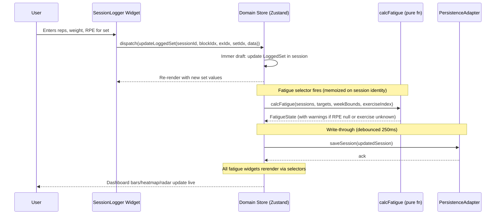
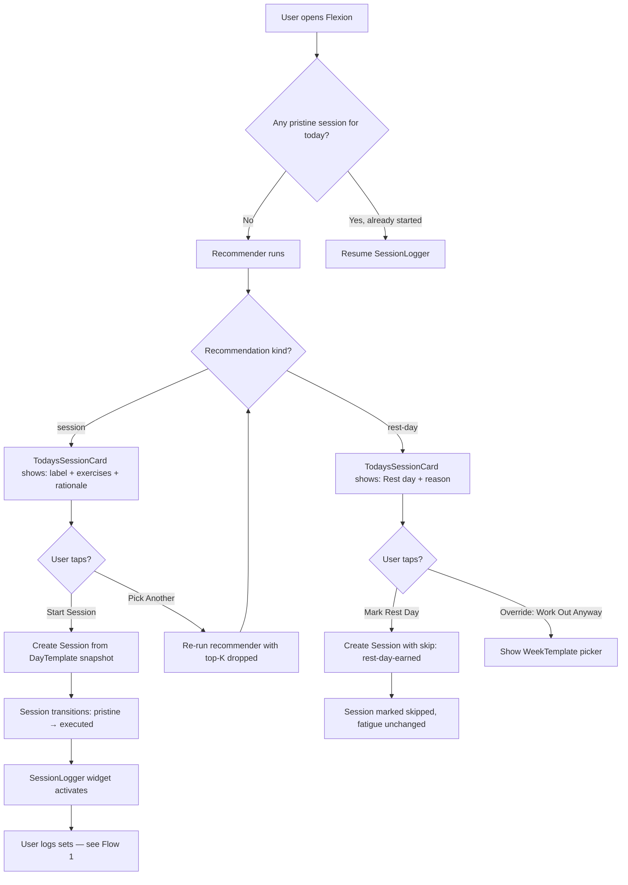
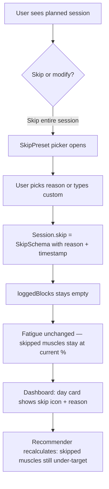
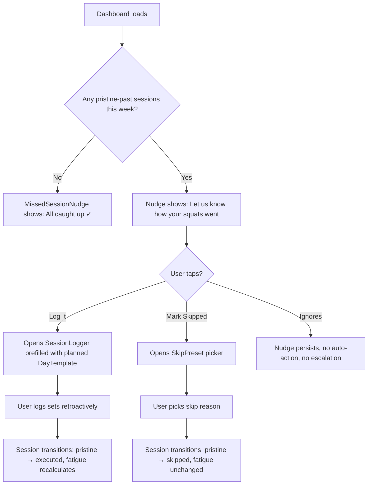
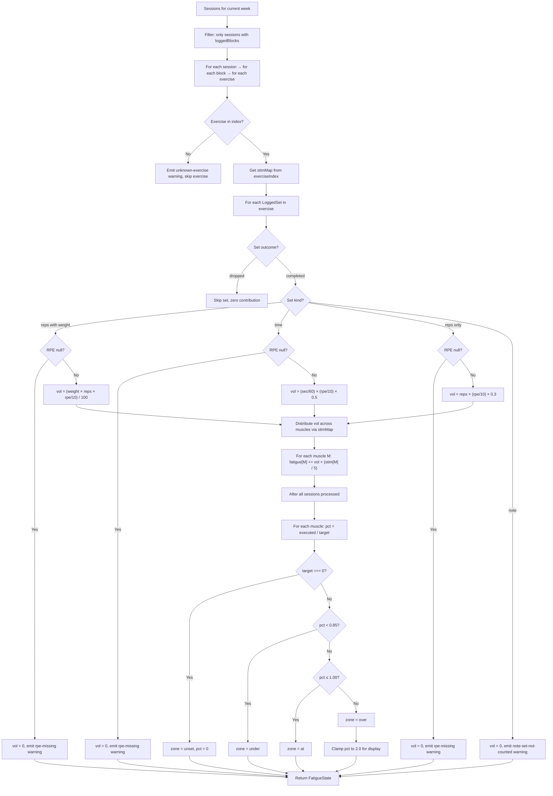
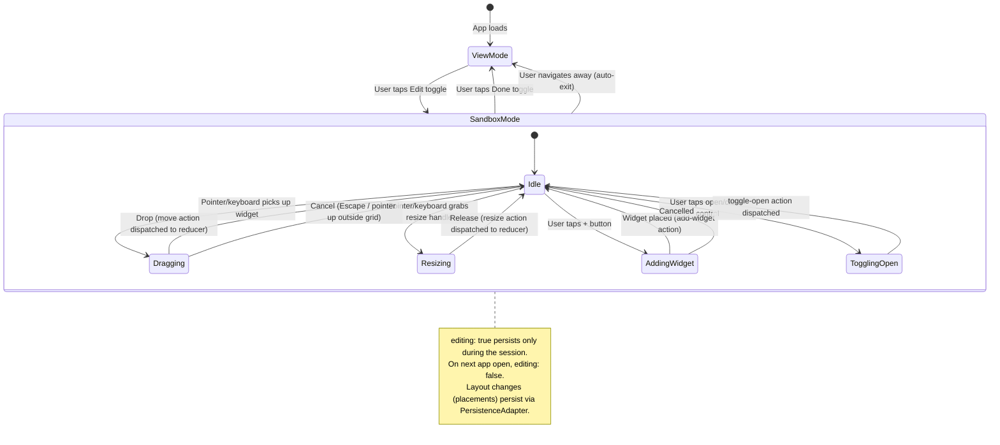
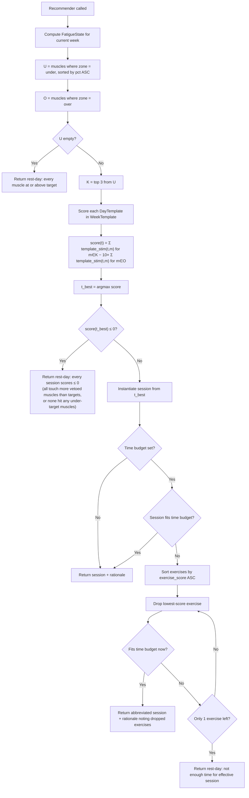
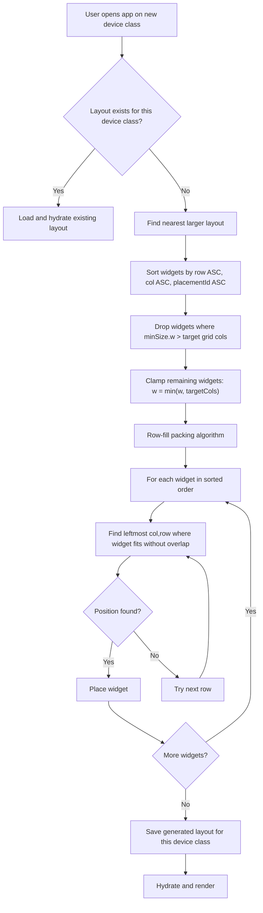
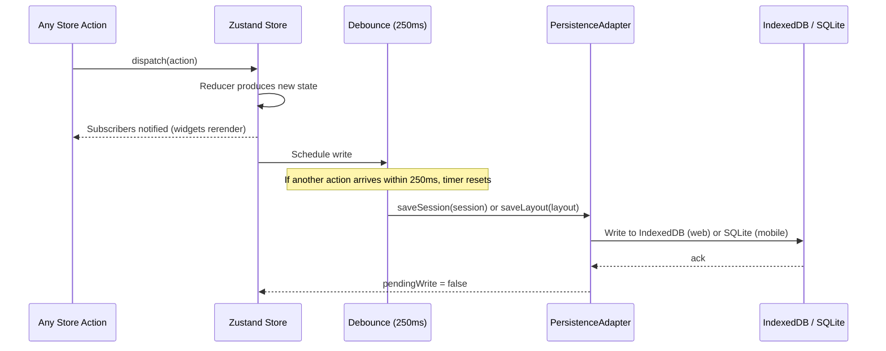

# 04 — Flowcharts

> All diagrams use Mermaid syntax. Render at [mermaid.live](https://mermaid.live) or in any Mermaid-compatible viewer (VS Code preview, GitHub markdown).
>
> These flows are derived from `02-DOMAIN-MODEL.md`, `03-FATIGUE-SYSTEM.md`, `05-COMPONENTS.md`, and `06-SANDBOX-MODE.md`. If a diagram here contradicts a spec doc, the spec doc wins.

## 1. Log a set (the most important flow)

The critical path: user taps a set row in the Session Logger, enters reps/weight/RPE, and the fatigue gauge updates live.



**Key latency target:** from user keystroke to fatigue bar update < 200ms p95 (see `00-VISION.md` success criteria #2).

## 2. Start a session (from recommendation)



## 3. Skip a session



## 4. Modify mid-session (swap exercise)

```mermaid
sequenceDiagram
    participant U as User
    participant SL as SessionLogger
    participant ALT as Alternatives Modal
    participant DS as Domain Store
    participant FR as calcFatigue

    U->>SL: Taps "🔄 Swap" on Barbell Squat
    SL->>ALT: Opens modal with ExerciseAlternatives for barbell-back-squat
    ALT-->>U: Shows: Leg Press (1.5×), Hack Squat (0.9×), Front Squat (0.8×)

    U->>ALT: Picks Leg Press
    ALT->>DS: dispatch(substituteExercise(sessionId, blockIdx, exIdx, 'leg-press'))
    DS->>DS: LoggedExercise.exerciseSlug = 'leg-press'
    DS->>DS: LoggedExercise.substitutedFrom = 'barbell-back-squat'
    DS->>DS: LoggedSet[].weight *= 1.5, rounded to nearest 5 lb
    DS->>DS: Add Modification({ type: 'exercise-substituted', reason: preset text })

    Note over DS,FR: Fatigue recomputes against Leg Press stim map (not Squat)
    DS->>FR: calcFatigue(...)
    FR-->>DS: New FatigueState — quads still stimulated, but stim weights differ

    DS-->>U: Logger shows Leg Press with scaled weights, fatigue bars update
```

## 5. Backfill a missed session (pristine-past nudge)



## 6. Fatigue recompute pipeline

Shows how `calcFatigue` processes a week's sessions into the `FatigueState` that every widget reads.



## 7. Sandbox mode: enter, edit, exit



## 8. Recommender decision flow



## 9. Per-device layout down-projection



## 10. Persistence write-through



## What these diagrams don't cover (deferred)

- **Auth flows** — there is no auth in v1 (single-user, local-first).
- **Sync flows** (web ↔ mobile) — v1 is local-only per platform. Sync is Phase 6+.
- **Program creation/editing** — v1 uses preset WeekTemplates. Custom program design is Phase 2+.
- **Routine player step-by-step flow** — the RoutinePlayer is a route, not a widget flow; documented when routes are documented.
